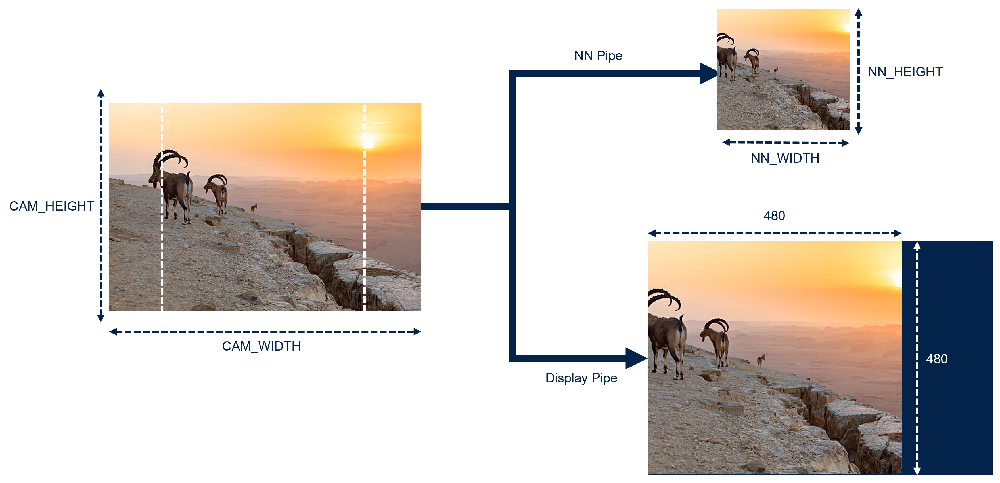
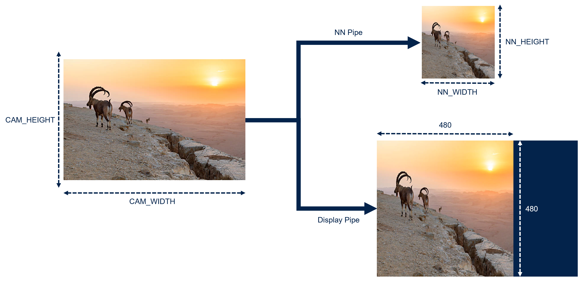
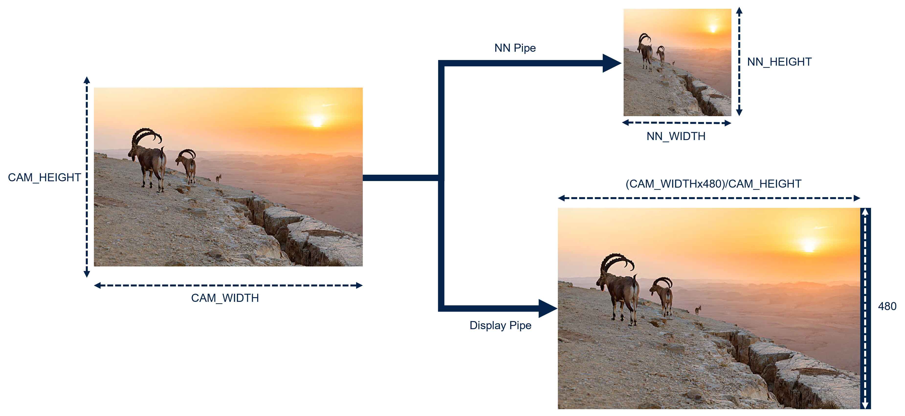

# Build Options

Some features are enabled using build options or using `app_config.h`:

- [Cameras module](#cameras-module)
- [Camera Orientation](#camera-orientation)
- [Aspect Ratio Mode](#aspect-ratio-mode)
- [Image preprocessing](#image-preprocessing)

This documentation explains those features and how to modify them.

## Cameras module

The application is compatible with 3 cameras:

- MB1854B IMX335 (Default Camera provided with the MB1939 STM32N6570-DK board)
- ST VD66GY
- ST VD55G1
- ST VD1943

By default, the app is built to support the 3 cameras in the same binary. It dynamically detects which sensor is connected.
To remove support for specific sensors, delete the corresponding defines in [Inc/Application/STM32N6570-DK/Inc/cmw_camera_conf.h](../Application/STM32N6570-DK/Inc/cmw_camera_conf.h#L44) or [Inc/Application/NUCLEO-N657X0-Q/Inc/cmw_camera_conf.h](../Application/NUCLEO-N657X0-Q/Inc/cmw_camera_conf.h#L44).

## Camera Orientation

Cameras allow you to flip the image along 2 axes.

- CMW_MIRRORFLIP_MIRROR: Selfie mode
- CMW_MIRRORFLIP_FLIP: Flip upside down.
- CMW_MIRRORFLIP_FLIP_MIRROR: Flip Both axis
- CMW_MIRRORFLIP_NONE: Default

1. Open [Inc/Application/STM32N6570-DK/Inc/app_config.h](../Application/STM32N6570-DK/Inc/app_config.h) or [Inc/Application/NUCLEO-N657X0-Q/Inc/app_config.h](../Application/NUCLEO-N657X0-Q/Inc/app_config.h)

2. Change CAMERA_FLIP define:

```C
/*Defines: CMW_MIRRORFLIP_NONE; CMW_MIRRORFLIP_FLIP; CMW_MIRRORFLIP_MIRROR; CMW_MIRRORFLIP_FLIP_MIRROR;*/
#define CAMERA_FLIP CMW_MIRRORFLIP_FLIP
```

## Aspect Ratio Mode

### Image preprocessing

To fit the camera image to the NN input and to the display 3 options are provided.

- `ASPECT_RATIO_CROP`:
  - NN_Pipe: The frame is cropped to fit into a square with a side equal to the NN dimensions. The aspect ratio is kept but some pixels are lost on each side of the image.
  - Display_Pipe: The displayed frame is cropped identically to the nn pipe. You see what the NN sees but with an upscaled format of 480x480 (Max height of the lcd display)



- `ASPECT_RATIO_FIT`:
  - NN_Pipe: The frame is resized to fit into a square with a side equal to the NN dimensions. The aspect ratio is modified.
  - Display_Pipe: The frame is resized as the NN. The frame is resized to fit into a square with a side equal to the height of the lcd display.



- `ASPECT_RATIO_FULLSCREEN`:
  - NN_Pipe: The frame is resized to fit into a square with a side equal to the NN dimensions. The aspect ratio is modified.
  - Display_Pipe: The frame is displayed full screen; this maximizes the size of the display. The frame is not distorted. Aspect ratios of nn input and display are different.



1. Open [Inc/Application/STM32N6570-DK/Inc/app_config.h](../Application/STM32N6570-DK/Inc/app_config.h) or [Inc/Application/NUCLEO-N657X0-Q/Inc/app_config.h](../Application/NUCLEO-N657X0-Q/Inc/app_config.h)
2. Change ASPECT_RATIO_MODE:

```C
#define ASPECT_RATIO_CROP (1)
#define ASPECT_RATIO_FIT (2)
#define ASPECT_RATIO_FULLSCREEN (3)
#define ASPECT_RATIO_MODE ASPECT_RATIO_FULLSCREEN
```
